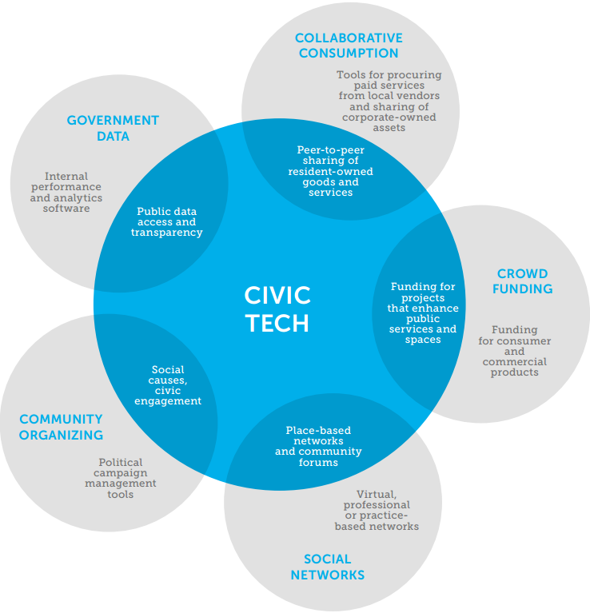

# What is Civic Tech?

## Technology that helps governments and communities interact

[Venn Diagram from Knight Foundation, page 6](http://www.knightfoundation.org/media/uploads/publication_pdfs/knight-civic-tech.pdf)

# What does Code for America (CfA) do?

## Bring together **local goverments** and **technologists** to make **better cities for everyone**

(Help government provide better services through good design, technology, and lightweight processes.)

## What does that look like?

### Fellowship

#### Goals

- Partner with governments for a year
- Create a free, open source application
- Demonstrate a design/iterative approach to projects (more on this later...)

#### Projects

- [Honolulu Answers](http://answers.honolulu.gov/)
- [Discover BPS](http://www.discoverbps.org/)
- [Street Mix](http://streetmix.net/)
- [Transit Mix](http://www.transitmix.net/)

### Brigade

Network of volunteers that collaborate with local government to make their communities better.

#### [Open Oakland](http://openoakland.org/)

Heavy focus on transparent government.

Example Projects
- Open Data Portal
- Open Budget
- Councilmatic
- Oakland Wiki

#### [Code for Philly](http://codeforphilly.org/)

Lots of interest around transit and climate.

Example Projects
- SEPTA.MOBI
- Bike Route Tracker (CyclePhilly)
- Unlock Philly
- Solar Sunflower

### Peer Network

Government innovators can connect with each other to share resources and best practices.

### Accelerator

- For civic tech startups
- 200+ hours of training/support
- Co-working space at CfA's offices
- Product exposure at CfA Summit (Q3 every year)
- Access to CfA network
- $25,000 seed money

### Incubator

Like Accelerator, but for past Fellowship teams created startups from their projects.